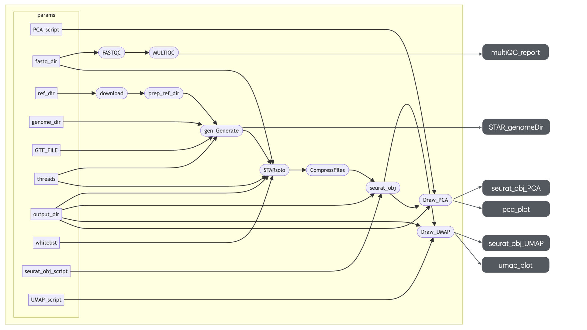

# nextflow_501Project

## Background and Rationale

This pipeline is designed for single-cell RNA sequencing (scRNA-seq) data analysis. It uses **FastQC**, **MultiQC**, **STARsolo**, and **Seurat** to process, analyze, and visualize scRNA-seq data. Key features include quality control, genome generation, mapping, and downstream clustering analysis with visualization.

### Aims:
- Perform quality control of raw sequencing reads.
- Generate genome references and map reads using STARsolo.
- Create and analyze Seurat objects for clustering and visualization.

### Dependencies:
- git
- Nextflow (`=21.10.0`)
- Singularity (`=3.5.2-1.1.el7`for containerized execution)
- Software dependencies included in containers:
  - **biocontainers/fastqc**
  - **ewels/multiqc**
  - **quay.io/biocontainers/star**
  - **satijalab/seurat**

### DAG

---

## Usage

### Installation

1. Clone the repository:
   ```bash
   git clone https://github.com/RobinLi7/nextflow_501Project.git
   ```
   
2. Make sure Nextflow (`=21.10.0`) is installed.\
   [Installation guide](https://www.nextflow.io/docs/latest/install.html)

4. Make sure Singularity (`=3.5.2-1.1.el7`) is installed and configured. If you are using a BCGSC computer, there is no need for installation or configuration.\
   [Installation guide](https://docs.sylabs.io/guides/3.0/user-guide/installation.html)
   
6. Download the reference genome files:\
   There is a `download` process in my Nextflow pipeline that will handle the downloads automatically.

---

### Running the Pipeline
Go to the project directory
```bash
cd nextflow_501Project/
```
And run
```bash
nextflow run nextflow_version.nf 
```

### Parameters

| Parameter            | Description                                               | Default Value                              |
|-----------------------|-----------------------------------------------------------|-------------------------------------------|
| `fastq_dir`          | Directory containing the input FASTQ files.                | `${projectDir}/data`                      |
| `output_dir`         | Directory where the output files will be stored.           | `${projectDir}/result`                    |
| `ref_dir`            | Directory for storing reference files.                     | `${projectDir}/ref`                       |
| `GTF_FILE`           | Path to the GTF file for gene annotations.                 | `${projectDir}/ref/chr1_chr2_chr3.gtf`    |
| `genome_dir`         | Directory containing the STAR genome index.                | `${projectDir}/ref/STAR_genomeDir`        |
| `threads`            | Number of threads for parallel execution.                  | `8`                                       |
| `whitelist`          | Path to the whitelist file used for cell barcodes.         | `${projectDir}/ref/CellRanger/3M-february-2018.txt` |
| `seurat_obj_script`  | Path to the R script for creating Seurat objects.          | `${projectDir}/code/seurat_obj.R`         |
| `UMAP_script`        | Path to the R script for generating UMAP plots.            | `${projectDir}/code/draw_UMAP.R`          |
| `PCA_script`         | Path to the R script for generating PCA plots.             | `${projectDir}/code/draw_PCA.R`           |

---

## Input

- **FASTQ files**: Paired-end sequencing reads named as `*_1.fastq.gz` and `*_2.fastq.gz`.
- **Genome files**:
  - Fasta files: `chr1.fa`, `chr2.fa`, `chr3.fa`.
  - Annotation file: `gencode.v38.annotation.gtf`.

---

## Output

- **Quality Control**:
  - Per-sample FastQC reports (`fastqc_result`).
  - MultiQC summary (`multiQC_report.html`).

- **Genome Files**:
  - STAR genome index files in `ref/STAR_genomeDir`.

- **Mapping Results**:
  - STARsolo outputs in `tmp/STARsolo`.

- **Seurat Objects**:
  - Processed object: `seurat_obj.rds`.

- **Visualizations**:
  - UMAP plot (`umap_plot.png`).
  - PCA plot (`pca_plot.png`).

---

## Notes

- Ensure proper Singularity setup for containerized execution.
- For any issues, please contact contributors listed in `nextflow.config`.
