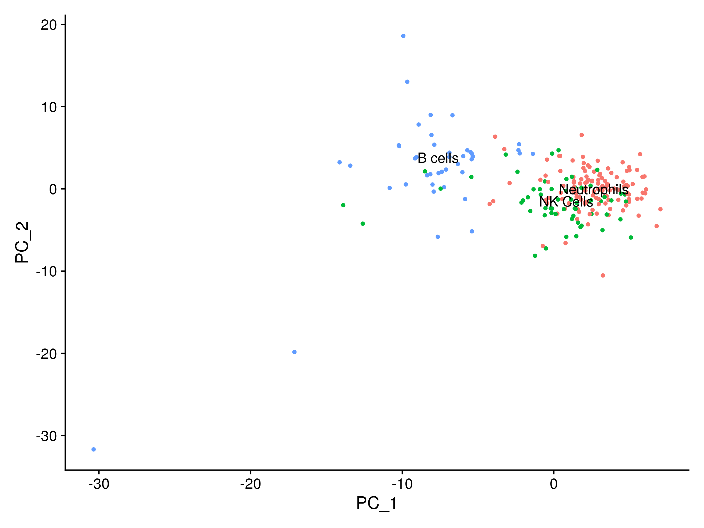
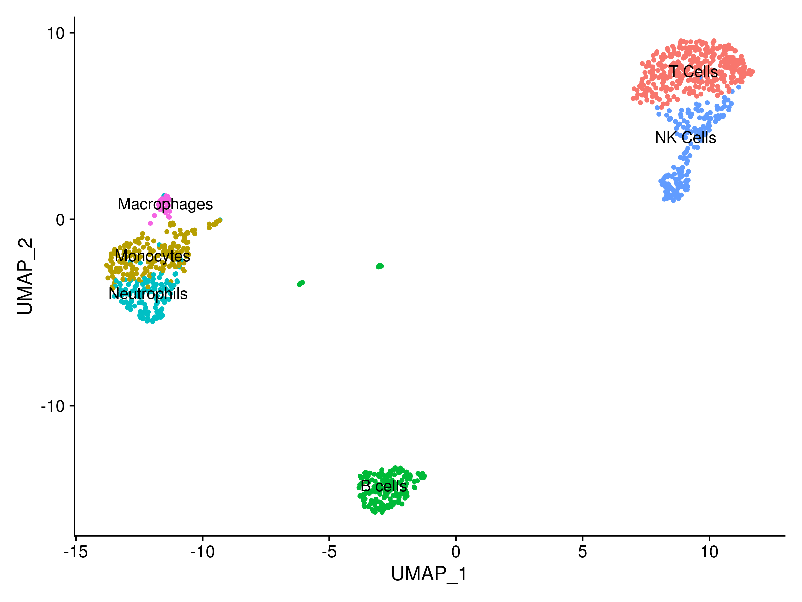

# nextflow_501Project
## by ***Junyu (Robin) Li***

---

## Background and Rationale

In single-cell RNA sequencing (scRNA-seq) analysis, datasets often encompass thousands of genes across numerous cells, resulting in high-dimensional data that can be challenging to interpret. Dimensionality reduction techniques like Principal Component Analysis (PCA) and Uniform Manifold Approximation and Projection (UMAP) are essential for simplifying this complexity, enabling effective visualization and analysis.

**Principal Component Analysis (PCA):**
PCA is a linear method that identifies directions (principal components) capturing the maximum variance in the data. By projecting data onto these components, PCA reduces dimensionality while preserving significant variation, facilitating the identification of distinct cell populations. 

**Uniform Manifold Approximation and Projection (UMAP):**
UMAP is a nonlinear technique that preserves both local and global data structures during dimensionality reduction. It projects high-dimensional data into lower dimensions, maintaining relationships between data points, which is particularly useful for revealing complex cell population structures and developmental trajectories in scRNA-seq analysis. 

**Rationale for Integration:**
Incorporating PCA and UMAP into the scRNA-seq analysis pipeline addresses several key challenges:

1. **Noise Reduction:** By focusing on principal components that capture the most variance, PCA helps mitigate the impact of technical noise inherent in scRNA-seq data.

2. **Computational Efficiency:** Reducing dimensionality decreases computational demands, making downstream analyses like clustering more efficient.

3. **Enhanced Visualization:** UMAP provides intuitive visualizations of complex data structures, aiding in the identification of cell clusters and relationships.

By integrating PCA and UMAP, the pipeline effectively simplifies complex scRNA-seq datasets, facilitating the extraction of meaningful biological insights. 


### Aims:
- Perform quality control of raw sequencing reads.
- Generate genome references and map reads using STARsolo.
- Create and analyze Seurat objects for clustering and visualization.

### Dependencies:
- git
- Nextflow (`=21.10.0`)
- Singularity (`=3.5.2-1.1.el7`for containerized execution)
- Software dependencies included in containers:
  - **biocontainers/fastqc**
  - **ewels/multiqc**
  - **quay.io/biocontainers/star**
  - **satijalab/seurat**

### DAG


#### **Input Data Preparation**
   - Accepts FASTQ files from 10x Genomics experiments, a barcode whitelist, and a reference genome.
   - These files provide the raw sequencing data and metadata required for downstream analysis.

#### **Quality Control**
   - Runs **FastQC** [2] to assess sequencing quality and aggregates results using **MultiQC** [3].
   - Ensures the integrity of sequencing data before alignment and quantification.

#### **Reference Genome Indexing**
   - Uses **STAR** [4] to create genome indices for alignment.
   - Prepares the reference genome for efficient alignment of sequencing reads.

#### **Alignment and Quantification**
   - Aligns sequencing reads to the genome using **STARsolo** [1] and quantifies gene expression.
   - Maps reads to the genome and generates raw gene expression matrices for downstream analysis.

#### **Downstream Analysis with Seurat**
   - Processes the gene expression matrix using R scripts with **Seurat** [5] to perform normalization, dimensionality reduction, and clustering.
   - Extracts meaningful biological information, such as cell clusters and marker genes.

#### **Visualization**
   - Generates plots for PCA and UMAP to visualize cell clustering.
   - Facilitates interpretation of single-cell data in reduced-dimensional space.


---

## Usage

### Installation

1. Clone the repository:
   ```bash
   git clone https://github.com/RobinLi7/nextflow_501Project.git
   ```
   
2. Make sure Nextflow (`=21.10.0`) is installed.\
   [Installation guide](https://www.nextflow.io/docs/latest/install.html)

3. Make sure Singularity (`=3.5.2-1.1.el7`) is installed and configured. \
   If you are using a BCGSC computer, there is no need for installation or configuration.\
   [Installation guide](https://docs.sylabs.io/guides/3.0/user-guide/installation.html)
   
4. Download the reference genome files:\
   There is a `download` process in my Nextflow pipeline that will handle the downloads automatically.


### Running the Pipeline
Go to the project directory
```bash
cd nextflow_501Project/
```
And run
```bash
nextflow run nextflow_version.nf 
```

### Parameters

| Parameter            | Description                                               | Default Value                              |
|-----------------------|-----------------------------------------------------------|-------------------------------------------|
| `fastq_dir`          | Directory containing the input FASTQ files.                | `${projectDir}/data`                      |
| `output_dir`         | Directory where the output files will be stored.           | `${projectDir}/result`                    |
| `ref_dir`            | Directory for storing reference files.                     | `${projectDir}/ref`                       |
| `GTF_FILE`           | Path to the GTF file for gene annotations.                 | `${projectDir}/ref/chr1_chr2_chr3.gtf`    |
| `genome_dir`         | Directory containing the STAR genome index.                | `${projectDir}/ref/STAR_genomeDir`        |
| `threads`            | Number of threads for parallel execution.                  | `8`                                       |
| `whitelist`          | Path to the whitelist file used for cell barcodes.         | `${projectDir}/ref/CellRanger/3M-february-2018.txt` |
| `seurat_obj_script`  | Path to the R script for creating Seurat objects.          | `${projectDir}/code/seurat_obj.R`         |
| `UMAP_script`        | Path to the R script for generating UMAP plots.            | `${projectDir}/code/draw_UMAP.R`          |
| `PCA_script`         | Path to the R script for generating PCA plots.             | `${projectDir}/code/draw_PCA.R`           |

---

## Input

The pipeline processes **10x Genomics scRNA-seq data** and requires the following input data:

### 1. **FASTQ Files**
- The input FASTQ files are generated from 10x Genomics platforms and follow this standard naming convention:
  ```
  pbmc_1k_v3_S1_L001_R1_001.fastq.gz
  pbmc_1k_v3_S1_L001_R2_001.fastq.gz
  ```
  - **R1**: Contains the cell barcodes and unique molecular identifiers (UMIs).
  - **R2**: Contains the actual RNA sequences for downstream analysis.

- For demonstration purposes, this pipeline uses a **subsample** of the original data. The subsampling is performed to reduce computational resource usage while testing the pipeline. 

- **Subsampling Command**: The following `seqtk` command was used to randomly sample 2,000,000 reads from the original FASTQ file:
  ```bash
  seqtk sample -s777 data/pbmc_1k_v3_S1_L001_R1_001.fastq.gz 2000000 > data/genome_1.fastq
  seqtk sample -s777 data/pbmc_1k_v3_S1_L001_R2_001.fastq.gz 2000000 > data/genome_2.fastq
  gzip data/genome_*.fastq
  ```
  - **`-s777`**: Sets the random seed for reproducibility.
  - **`2000000`**: Specifies the number of reads to sample.
  - The resulting file `genome_1.fastq.gz` and `genome_1.fastq.gz` is included in the `data` folder for this pipeline.

### 2. **Genome Files**
The pipeline uses a subset of the human genome as a reference, specifically the chromosomes `chr1`, `chr2`, and `chr3`. These files include:
- **FASTA Files**: Contain the nucleotide sequences for the reference genome. The required files are:
  - `ref/chr1.fa`: Sequence for chromosome 1.
  - `ref/chr2.fa`: Sequence for chromosome 2.
  - `ref/chr3.fa`: Sequence for chromosome 3.
- **Annotation File (GTF)**: Provides functional annotations of genes, including their locations on the genome and exon structures.
  - File used: `ref/gencode.v38.annotation.gtf`.
  - This file is filtered to include annotations only for `chr1`, `chr2`, and `chr3` named `ref/chr1_chr2_chr3.gtf`.

### 3. **Barcode Whitelist**
- A whitelist file is required for cell barcode validation during alignment. 
- File: `ref/CellRanger/3M-february-2018.txt`, provided by the Cell Ranger dataset.
- It ensures that only valid cell barcodes are used in the downstream analysis.

### 4. **Optional Custom Inputs**
- If users wish to expand the analysis to additional chromosomes or use a different reference genome, they need to replace the provided genome and annotation files with their own.

### Important Notes:
- All genome and annotation files are downloaded and preprocessed automatically by the pipeline during execution.

---

#### Reason for Using Subsection of STAR Index
The subset STAR index, limited to chromosomes `chr1`, `chr2`, and `chr3`, is included in the pipeline for **testing and debugging purposes**. This approach significantly reduces the runtime and storage requirements, making it feasible to quickly validate the pipeline functionality. Key reasons for this choice are:

1. **Running Time**:
   - Generating the full STAR genome index and running the pipeline with the complete dataset takes **several hours**, depending on the computational resources available.
   - Using a subset index allows for much faster testing, enabling quick feedback and iteration.

2. **Storage Requirements**:
   - The full STAR genome index requires approximately **28GB of storage**.
   - The subset STAR index dramatically reduces storage usage, making it practical for environments with limited disk space.

The results in `result/` demonstrate the outputs of running the pipeline with the subset STAR genome index.

## Expected Output

- **Quality Control** (`result/multiQC_report.html`):
  - A HTML file that visualize base quality scores, GC content, sequence length distribution, sequence duplication levels, k-mer over-representation and contamination of primers and adapters in the input fastq.

- **STAR Genome Index** (`ref/STAR_genomeDir/`):
  - Contains the genome index files generated by STAR. These files are required for read alignment.
  - These files are crucial for mapping reads to the genome efficiently.

- **Seurat Object with PCA Results** (`result/seurat_obj_PCA.rds`):
  - This file contains the preprocessed single-cell RNA-seq data, including normalization, identification of variable features, scaling, and Principal Component Analysis (PCA) results. It serves as a foundation for downstream analyses and visualizations, particularly those involving PCA.

- **Seurat Object with UMAP Results** (`result/seurat_obj_UMAP.rds`):
  - This file includes the same preprocessed data as the PCA object but extends the analysis by incorporating Uniform Manifold Approximation and Projection (UMAP) results. It's utilized for visualizations and analyses that require UMAP embeddings.


- **Visualizations**:
  - **UMAP plot** (`result/umap_plot.png`).
  - Displays the clusters of single cells in a 2D space, based on the UMAP dimensionality reduction algorithm. Each cluster is labeled with its assigned identity.
    
  - **PCA plot** (`result/pca_plot.png`).
  - Visualizes the principal components of the data, showing variance explained by each component and how the cells cluster in this reduced-dimensional space.
    

---

## Output for FULL STAR index
In addition to the results generated using the subset STAR index (chr1, chr2, chr3), the pipeline has been tested using the **full STAR genome index** to demonstrate its capability for comprehensive analysis. These results are stored in the directory `result_full_ref/` and reflect alignment and quantification based on the entire genome reference. 

You can modify the `download` process in `nextflow_version.nf` to download all the chromosomes from `hg38` instead of only downloading chromosomes 1, 2, and 3. Additionally, comment out the line for filtering the `*annotation.gtf` file in the `prep_ref_dir` process and update the file name in the `gen_Generate` process to achieve this.

- **Quality Control** (`result_full_ref/multiQC_report.html`):
  - A HTML file that visualize base quality scores, GC content, sequence length distribution, sequence duplication levels, k-mer over-representation and contamination of primers and adapters in the input fastq.

- **Visualizations**:
  - **UMAP plot** (`result_full_ref/umap_plot.png`).
  - Displays the clusters of single cells in a 2D space, based on the UMAP dimensionality reduction algorithm. Each cluster is labeled with its assigned identity.
    
  - **PCA plot** (`result_full_ref/pca_plot.png`).
  - Visualizes the principal components of the data, showing variance explained by each component and how the cells cluster in this reduced-dimensional space.
    

---

## Reference
1. Kaminow, B., Yunusov, D., & Dobin, A. (2021). STARsolo: accurate, fast and versatile mapping/quantification of single-cell and single-nucleus RNA-seq data. *bioRxiv*. https://doi.org/10.1101/2021.05.05.442755 
2. Andrews, S. (2010). FastQC: A Quality Control tool for High Throughput Sequence Data. Available online: https://www.bioinformatics.babraham.ac.uk/projects/fastqc/ 
3. Ewels, P., Magnusson, M., Lundin, S., & Käller, M. (2016). MultiQC: summarize analysis results for multiple tools and samples in a single report. *Bioinformatics*, 32(19), 3047–3048. https://doi.org/10.1093/bioinformatics/btw354 
4. Dobin, A., Davis, C. A., Schlesinger, F., Drenkow, J., Zaleski, C., Jha, S., ... & Gingeras, T. R. (2013). STAR: ultrafast universal RNA-seq aligner. *Bioinformatics*, 29(1), 15–21. https://doi.org/10.1093/bioinformatics/bts635
5. Hao, Y., Stuart, T., Kowalski, M. H., Choudhary, S., Hoffman, P., Hartman, A., ... & Satija, R. (2023). Dictionary learning for integrative, multimodal and scalable single-cell analysis. *Nature Biotechnology*. https://doi.org/10.1038/s41587-023-01767-y 


